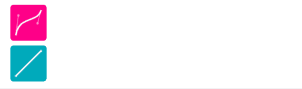

# Android 动画里的贝塞尔曲线


对贝塞尔曲线的听闻，大概是 Photoshop 里的钢笔工具，用来画曲线的，但一直不明白这个曲线有什么用，接触学习到 Android 动画，又发现了贝塞尔曲线的身影，这玩意不是在绘图软件里画曲线的吗，怎么和动画扯上关系了，好吧，今天高低得来了解一下。  


## [插值](https://zh.wikipedia.org/wiki/%E6%8F%92%E5%80%BC)

首先我们得知道什么是插值，数学里面的插值（Interpolation），是一种通过已知的、离散的数据点，在范围内推求新数据点的过程或方法。

下面这个表给出了某个未知函数 $f$ 的值，函数的具体表达式我们并不知道。

|  x   | f(x)    |
| :--: | ------- |
|  0   | 0       |
|  1   | 0.08415 |
|  2   | 0.9093  |
|  3   | 0.1411  |
|  4   | −0.7568 |
|  5   | −0.9589 |
|  6   | −0.2794 |


现在让你估算出 $ x=2.5 $ 时，$ f(x) $ 的值。

简单嘛，已知 $ f(2)=0.9093 $ 、$f(3)=0.1411$，连接两个已知点，$f(2.5)$ 不就是线段中点嘛，$(0.9093-0.1411)/2$，一下子就算出来了。这个通过已知的、离散的数据点，在范围内推求新数据点的过程其实就叫做 "插值"。


插值有多种方法，上面这种粗暴地将相邻已知点连接为线段，然后按比例取线段上某个点，来推求新数据点，属于"线性插值"。

虽然口头上表达这个过程不难，可如果这是一道数学试卷上面的解答题，请问阁下又该如何作答呢？


### [线性插值](https://zh.wikipedia.org/wiki/%E7%BA%BF%E6%80%A7%E6%8F%92%E5%80%BC)

咱们再来一道


假设已知坐标 $ \left ( {{x}_{0},\, {y}_{0}} \right ) $ 与 $ \left ( {{x}_{1},\, {y}_{1}} \right ) $，求：  $ \left [ {{x}_{0},\, {x}_{1}} \right ] $ 区间内某一位置 $x$ 在所对应的 $y$ 值。

因为 $ \left ( {{x}_{0},\, {y}_{0}} \right ) $ 和 $ \left ( x,\, y \right ) $ 之间的斜率，与 $ \left ( {{x}_{0},\, {y}_{0}} \right ) $ 和 $ \left ( {{x}_{1},\, {y}_{1}} \right ) $ 之间的斜率相同，所以：
$$
{\frac {y-{y}_{0}} {x-{x}_{0}}=\frac {{y}_{1}-{y}_{0}} {{x}_{1}-{x}_{0}}\, }
$$
其中 $ {x}_{0} $、$ {y}_{0} $、$ {x}_{1} $、$ {y}_{1} $、$ x $ 都已知，那么：
$$
y=\frac {{y}_{1}-{y}_{0}} {{x}_{1}-{x}_{0}}·\left ( {x-{x}_{0}} \right )+{y}_{0}={y}_{0}+\left ( {{y}_{1}-{y}_{0}} \right )·\frac {x-{x}_{0}} {{x}_{1}-{x}_{0}}
$$


过程和上面的例子，线性插值推算未知函数 $ f(2.5) $ 的值其实是一样的，原来数学里线性插值的过程是这么表达的啊。


## [贝塞尔曲线](https://zh.wikipedia.org/wiki/%E8%B2%9D%E8%8C%B2%E6%9B%B2%E7%B7%9A)

### 线性贝塞尔曲线

线性贝塞尔曲线是一条两点之间的直线，给定点 ${P}_{0}$、${P}_{1}$，这条线由下式给出：
$$
B\left ( {t} \right )={P}_{0}+\left ( {{P}_{1}-{P}_{0}} \right )·t,\, t\in \left [ {0,\, 1} \right ]
$$


等等，这不就是线性插值吗，和线性插值公式一样，而且线性插值的结果也在一条两点之间的直线上。


### 二次方贝塞尔曲线

既然两个点线性插值可以表示一条两点之间的直线，或者说是一条线性贝塞尔曲线，那...3个点线性插值的结果，几何表示会是什么样？


同时对 ${P}_{0}{P}_{1}$ 、${P}_{1}{P}_{2}$ 进行插值：

${P}_{0}{P}_{1}$ 插值得到连续点 ${Q}_{0}$，描述线段 ${P}_{0}{P}_{1}$，是一条线性贝塞尔曲线；

${P}_{1}{P}_{2}$ 插值得到连续点 ${Q}_{1}$，描述线段 ${P}_{1}{P}_{2}$，是一条线性贝塞尔曲线；

在 ${P}_{0}{P}_{1}$ 、${P}_{1}{P}_{2}$ 插值的同时，用同样的插值因子对得到的 ${Q}_{0}{Q}_{1}$ 再插值，也就是对图中绿色线段进行插值，得到连续点 $B$，追踪连续点 $B$ 的运动轨迹，得到曲线 ${P}_{0}{P}_{2}$，也就是图中红色曲线，是一条二次贝塞尔曲线。


原来，两个及以上的点 线性插值函数 就是 贝塞尔曲线函数，我们可以简单地不断循坏迭代两点线性插值来得到最终结果。


### 动画速度曲线 与 三次方贝塞尔曲线




无论是网页设计里的 CSS 还是 Android 开发，它们里面的动画速度曲线其实是三次方贝塞尔曲线，由 4 个点不断两两插值得到。


我们自定义自己的动画曲线（三次方贝塞尔曲线）时，里面包含 4 个点的信息，其中第一个和最后一个点的坐标是 $(0, 0)$ 和 $(1, 1)$，我们还需要提供中间两个点的坐标。原来自定义动画曲线要填入 4 个数字的原因是这样啊，豁然开朗。

另外，你可以用网址 [cubic-bezier](cubic-bezier.com) 快速定制自己的动画曲线。


## Jetpack Compose——Easing

现实生活中极少存在线性匀速运动的场景，汽车启动、停下、自由落体运动等等都包含加速、减速，人的脑子里已经潜移默化地习惯了这种加速减速地运动。动画也是一种运动，设计动画的时候应该遵循现实世界的物理模型，让动画看起来更加自然，符合直觉。


缓动 Ease，表示缓慢地移动（缓动），在 CSS 过渡动画里面，我们可以选择动画的缓动（Easing）类型，其中一些关键字有：

- `linear`
- `ease-in`
- `ease-out`
- `ease-in-out`

在经典动画中，开始阶段缓慢，然后加速的动作称为 "slow in"；开始阶段运动较快，然后减速的动作称为 "slow out"。网络上面分别叫 "ease in" 和 "ease out"，这里的 in/out 可以理解成一个动画里的一开始（start）或者最后（end）

### slow in (ease in)


比较适合出场动画，因为开始阶段比较慢，容易让人注意到哪个元素要开始移动，然后加速飞到视线之外。

好比你送朋友，看到朋友上了车，车子缓缓启动，然后加速驶去。


### slow out (ease out)


比较适合进场动画，因为结束阶段比较缓慢，能让人清楚看到是哪个元素飞了进来。

就像你站在公交车站，看到一辆公交车远远飞速驶来，减速停下。


### ease in out

那 ease in out 又是啥呢？ease 是缓和的意思，而 in/out 前面说过可以看作是一次动画里面的开始或结束阶段。ease in out 自然就代表：在一次动画里的开始阶段和结束阶段，动作都是缓和的，仅中间阶段是加速的，能够将用户注意力集中在过渡的末端。这也是 Material Design 的标准缓动，由于现实世界中的物体不会立即开始或停止移动，这种缓动类型可以让动画更有质感。


这种动画曲线比较适合转换动画，也就是说一个元素运动过程中，没有涉及入场与离场，它始终位于屏幕内，只是由一种形态变换为另一种形态。


Jetpack Compose 里面，表示动画速度曲线的接口是 Easing，Compose 提供了 4 中常见的速度曲线：

```kotlin
/**
 * Elements that begin and end at rest use this standard easing. They speed up quickly
 * and slow down gradually, in order to emphasize the end of the transition.
 *
 * Standard easing puts subtle attention at the end of an animation, by giving more
 * time to deceleration than acceleration. It is the most common form of easing.
 *
 * This is equivalent to the Android `FastOutSlowInInterpolator`
 */
val FastOutSlowInEasing: Easing = CubicBezierEasing(0.4f, 0.0f, 0.2f, 1.0f)

/**
 * Incoming elements are animated using deceleration easing, which starts a transition
 * at peak velocity (the fastest point of an element’s movement) and ends at rest.
 *
 * This is equivalent to the Android `LinearOutSlowInInterpolator`
 */
val LinearOutSlowInEasing: Easing = CubicBezierEasing(0.0f, 0.0f, 0.2f, 1.0f)

/**
 * Elements exiting a screen use acceleration easing, where they start at rest and
 * end at peak velocity.
 *
 * This is equivalent to the Android `FastOutLinearInInterpolator`
 */
val FastOutLinearInEasing: Easing = CubicBezierEasing(0.4f, 0.0f, 1.0f, 1.0f)

/**
 * It returns fraction unmodified. This is useful as a default value for
 * cases where a [Easing] is required but no actual easing is desired.
 */
val LinearEasing: Easing = Easing { fraction -> fraction }
```

LinearEasing 是匀速运动，最好理解了，另外 3 个和前面提到的 CSS 里的 ease-in-out、ease-out、ease-in 其实都是对应的

-  ease-in-out => FastOutSlowIn
- ease-out => LinearOutSlowIn
- ease-in => FastOutLinearIn 


...真是想不明白 Compose 官方这个命名是从哪个角度理解的
