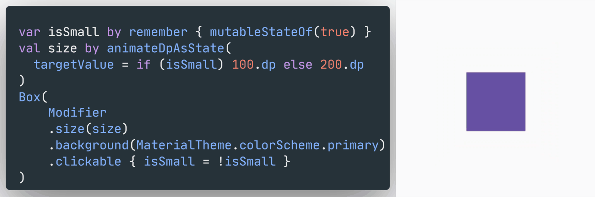
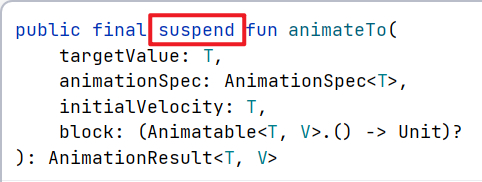
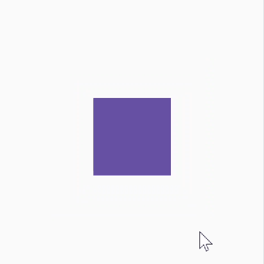
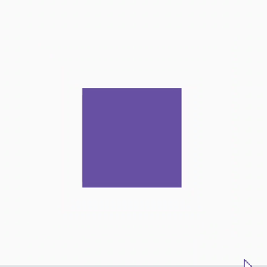
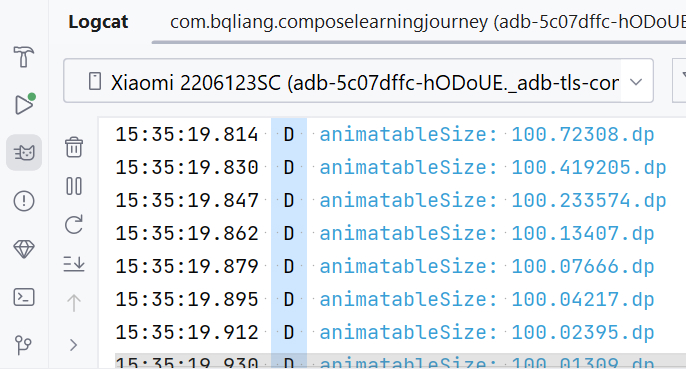

# Animatable

使用 ObjectAnimator 时，`ObjectAnimator.ofFloat(circleView, "radius", 100f)`，只填一个 value 值，执行动画时会先调用 `circleView.getRadius()` 获取当前 radius 值作为动画起点，再运动至终点 100f。这和 `animateFloatAsState` 是非常相似的，执行运动时，都是以当前状态值为起点，运动至目标值。

如果使用 `ObjectAnimator` 时填入多个 value 值：`ObjectAnimator.ofFloat(circleView, "radius", 20f, 100f)`，那么第一个值会被作为起点（初始值），最后一个值会被作为终点。注意了，初始值不一定就是当前状态值：例如，当前一刻圆的半径为 50f，我要在下一帧开始动画，要求动画初始值是 20f，目标值是 100f。与 `ObjectAnimator.ofFloat(circleView, "radius", 20f, 100f)` 对应的 Compose 动画应该怎么写呢？

用 `animateFloatAsState()` 是无法指定动画起始值的，它的动画起点只能是当前状态值。也就是说 `animateFloatAsState` 适用场景仅限于状态之间的来回切换（一个状态的终点是另一个状态的起点）。想要对动画做更多的定制，指定动画起始值，就要使用更底层的动画 API —— Animatable。

```kotlin
class Animatable<T, V : AnimationVector>(
    initialValue: T,
    val typeConverter: TwoWayConverter<T, V>,
    private val visibilityThreshold: T? = null,
    val label: String = "Animatable"
)
```

可以看到 Animatable 的构造函数有两个必填参数：初始值 initialValue 与 类型转换器 typeConverter。我们先不讨论怎么用 Animatable 指定动画初始值，从简单的开始，用 Animatable 来实现 `animateDpAsState` 在两个状态间来回切换的效果：



```kotlin
var isSmall by remember { mutableStateOf(true) }
// val size by animateDpAsState(targetValue = if (small) 100.dp else 200.dp)
val animatableSize = remember {
    Animatable(
        initialValue = if (isSmall) 100.dp else 200.dp, 
        typeConverter = Dp.VectorConverter
    )
}

Box(
    Modifier
    .size(animatableSize.value)
    .background(MaterialTheme.colorScheme.primary)
    .clickable { isSmall = !isSmall }
)
```

- 首先，用 `animateXxxAsState` 就是自动挡，它的内部已经包装了一层 remember，Animatable 是手动挡，需要自己包装一层 remember；
- 其次，创建 Animatable 对象实例时，不能也不应该能用 by 属性委托，应该直接用 =。想在这里使用 by 的人，无非是想着后续使用变量时，能直接写 `animatable` 获取到动画值 而不用 `animatable.value`，不过我们后续是要用到 Animatable 的一些方法的，所以这里不要用 `by`！
  ```kotlin
  // 假设这里可以用 by 属性委托
  val animatableSize: Dp by remember { Animatable(...) }
  // 注意 animatableSize 现在是一个 Dp 实例，而不是 Animatable 实例
  // 后续会需要用到 Animatable 实例，以调用 Animatable 的一些方法，
  // 但因为属性委托的原因，已经没机会获取到 Animatable 实例了
  ```

现在运行代码：


没有效果，回过头看填入数值的地方，你会发现 `animateDpAsState(targetValue = ...)` 的形参是 `targetValue`，而构造函数 `Animatable(initialValue = ...)` 构造函数的参数名是 `initialValue`。点击导致 isSmall 状态变化，只是重新设置了 Animatable 的初始值，而没有设置动画的目标值。

## animateTo()

我们需要手动调用 `Animatable.animateTo(targetValue = ...)` 来设置动画的目标值，第一次使用时你会发现这个方法居然还是个挂起函数



```kotlin
.clickable {
    small = !small
    lifecycleScope.launch {
        animatableSize.animateTo(if (small) 100.dp else 200.dp)
    }
}
```

即使套上一层 `lifecycleScope.launch{}` 也是不行的，在 Compose 中不能直接使用 `lifecycleScope.launch{}`，运行时会报错，即使不报错，也不应该这么写，在 `.clickable{}` 里用 `animateTo()` 设置动画本身就是不合理的。为什么呢？单纯的从设计理念的角度看，Compose 是声明式 UI 框架，状态驱动界面。事件产生处 `.clickable{}` 不应该直接和界面/动画打交道，而应该是修改状态，让**状态驱动界面/动画**：

```kotlin
var isSmall by remember { mutableStateOf(true) }
val animatableSize = remember {
    Animatable(
        initialValue = if (isSmall) 100.dp else 200.dp, 
        typeConverter = Dp.VectorConverter
    )
}

// 状态驱动动画
remember(isSmall) {
    协程.launch {
        animatableSize.animateTo(if (isSmall) 100.dp else 200.dp)
    }
}

Box(
    Modifier
    .size(animatableSize.value)
    .background(MaterialTheme.colorScheme.primary)
    .clickable {
        // 修改状态
        isSmall = !isSmall
    }
)
```

在 Compose 里面，有一个函数专门用于启动协程：`LaunchedEffect`，它的作用是在 Compose 的生命周期中启动协程

```kotlin
fun LaunchedEffect(
    key1: Any?,
    block: suspend CoroutineScope.() -> Unit
)
```

参数是 key 用于标识这个协程，当 key 变化时，会取消之前的协程，启动新的协程。所以我们可以在 `LaunchedEffect()` 所创建的协程作用域里面去调用挂起函数 `animateTo()`，完整代码如下：

```kotlin
var isSmall by remember { mutableStateOf(true) }
val size = remember(isSmall) { if (isSmall) 100.dp else 200.dp }
val animatableSize = remember {
    Animatable(
        initialValue = size,
        typeConverter = Dp.VectorConverter
    )
}

// 状态驱动动画
LaunchedEffect(isSmall) {
    animatableSize.animateTo(targetValue = size)
}

Box(
    Modifier
    .size(animatableSize.value)
    .background(MaterialTheme.colorScheme.primary)
    .clickable {
        // 修改状态
        isSmall = !isSmall
    }
)
```



## snapTo()

`animateTo()` 会让动画从当前值逐渐运动至目标值，如果想让动画直接跳到目标值，可以使用 `snapTo()`。回到文章一开始提到的需求，要设置动画起始值。在调用 `animateTo()` 开始动画之前，先调用 `snapTo()` 跳到起点。如此就做到了让动画从指定的起始值运动至目标值。

```kotlin
var isSmall by remember { mutableStateOf(true) }
val size = remember(isSmall) { if (isSmall) 100.dp else 200.dp }
val animatableSize = remember {
    Animatable(
        initialValue = size, 
        typeConverter = Dp.VectorConverter
    )
}

// 状态驱动动画
LaunchedEffect(isSmall) {
    if （!isSmall） {
        // 要变大时，先让动画跳到 0.dp，再运动至目标值
        animatableSize.snapTo(targetValue = 0.dp)
    }
    animatableSize.animateTo(targetValue = size)
}

Box(
    Modifier
    .size(animatableSize.value)
    .background(MaterialTheme.colorScheme.primary)
    .clickable {
        // 修改状态
        isSmall = !isSmall
    }
)
```



可以看到两个状态虽然是 100.dp 和 200.dp，不过在 100dp -> 200dp 的过程中，我们指定了动画的起始值是 0.dp，所以动画是会从 100.dp 跳到 0.dp，再运动至 200.dp。


## 监听动画

在使用 `Animatable.animateTo()` 的时候，通过参数 block 可以对动画过程进行监听。

```kotlin
suspend fun animateTo(
    targetValue: T,
    animationSpec: AnimationSpec<T> = defaultSpringSpec,
    initialVelocity: T = velocity,
    block: (Animatable<T, V>.() -> Unit)? = null
): AnimationResult<T, V>
```

还是用上面的例子

```kotlin
animatableSize.animateTo(targetValue = size) { // 拥有 Animatable 上下文
    Log.d("MainActivity", "animatableSize: ${this.value}")
}
```





## 动画的取消

