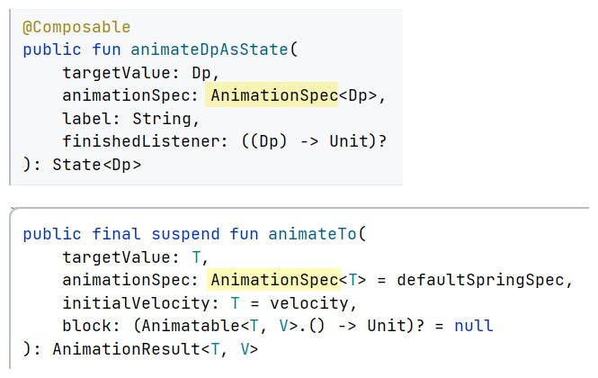
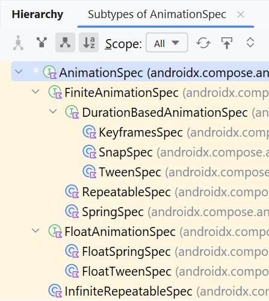
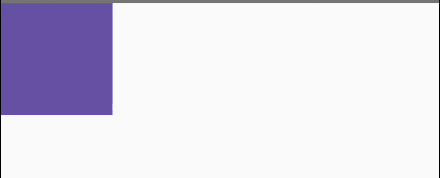
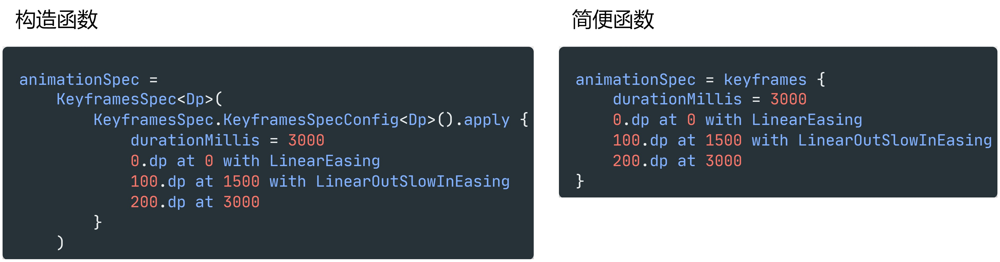
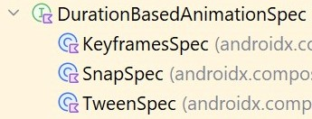
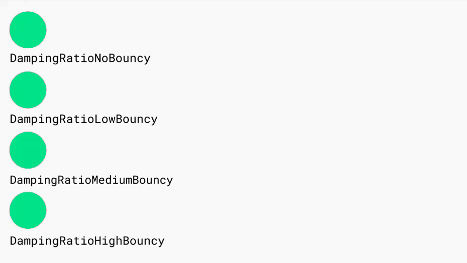
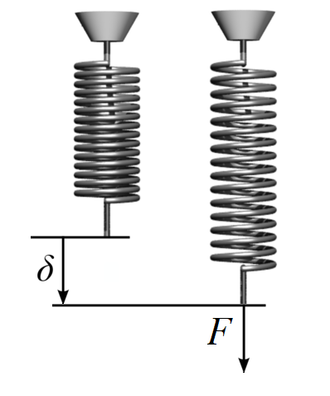
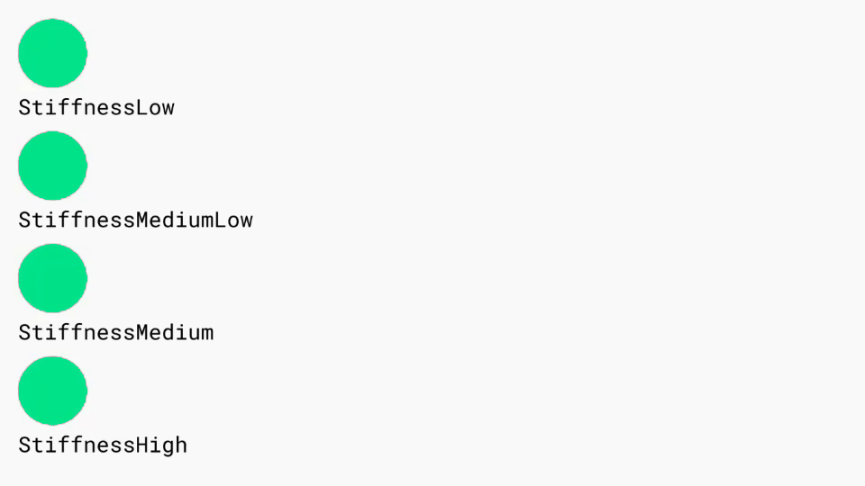
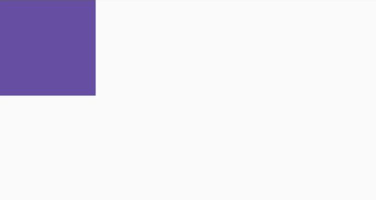

# Jetpack Compose——AnimationSpec

`Animatable` 动画可以通过参数 `AnimationSpec<T>` 来对动画进行详细配置，Spec 就是规格的意思，AnimationSpec 就是动画规格：



 `AnimationSpec<T>` 是一个接口，继承树🌳如下：



## FiniteAnimationSpec

### DurationBasedAnimationSpec

#### TweenSpec

TweenSpec 就是 AnimationSpec 其中的一个实现类，用于配置动画的持续时间、延迟和缓动曲线。

这里的 "tween" 是 "between" 的缩写，因为 TweenSpec 配置的是两个动画值之间的动画。例如动画起始值是 0.dp，目标值是 100.dp，TweenSpec 可以配置从 0.dp 变化到 100.dp 这个过程的时长、过程开始的延迟，以及过程的速度曲线。

调用 `tween()` 可以快速得到一个 TweenSpec 对象

```kotlin
BoxWithConstraints(modifier = Modifier.fillMaxSize()) {
    val boxSize = 100.dp 
    val maxOffsetX = maxWidth - boxSize
    var onLeft by remember { mutableStateOf(true) }
    val offsetX = remember(onLeft) { if (onLeft) 0.dp else maxOffsetX }
    val animatableOffsetX = remember {
        Animatable(
            initialValue = offsetX,
            typeConverter = Dp.VectorConverter
        )
    }

    LaunchedEffect(key1 = onLeft) {
        animatableOffsetX.animateTo(
            targetValue = offsetX,
            animationSpec = tween(
                delayMillis = 1000,    // 延迟 1 秒
                durationMillis = 2000, // 持续 2 秒
                easing = LinearEasing  // 匀速变化
            )
        )
    }

    Box(
        modifier = Modifier
        .offset(x = animatableOffsetX.value)
        .size(boxSize)
        .background(MaterialTheme.colorScheme.primary)
        .clickable { onLeft = !onLeft }
    )
}
```



这里最外层用的是一个 `BoxWithConstraints`，其实就是个类似 Box 的布局，不过它的函数参数 content 拥有 `BoxWithConstraintsScope` 上下文，在里面就可以获取 Box 的约束信息 `maxWidth`。

```kotlin
fun BoxWithConstraints(
    modifier: Modifier = Modifier,
    contentAlignment: Alignment = Alignment.TopStart,
    propagateMinConstraints: Boolean = false,
    content: @Composable @UiComposable BoxWithConstraintsScope.() -> Unit
)
...
interface BoxWithConstraintsScope : BoxScope {    
    val maxWidth: Dp
    ...
}
```


#### SnapSpec

和 `Animatable.snapTo()` 函数的作用差不多，SnapSpec 可以将动画配置成瞬间从初始值跳到目标值。不过 SnapSpec 可以设置动画延迟。

```kotlin
// 官方便捷函数
fun <T> snap(delayMillis: Int = 0) = SnapSpec<T>(delayMillis)

...

animatableOffsetX.animateTo(
    targetValue = offsetX,
    animationSpec = snap(delayMillis = 1000) // 延迟 1 秒
)
```


#### KeyFramesSpec

使用关键帧来配置动画。

这里推荐使用简便函数 `keyFrames()` 而不是 `KeyFramesSpec` 构造函数，如果使用构造函数的写法，还得手动创建一个 `KeyFramesSpecConfig` 对象：



```kotlin
// 官方便捷函数
fun <T> keyframes(
    init: KeyframesSpec.KeyframesSpecConfig<T>.() -> Unit
)

...

animatableOffsetX.animateTo(
    targetValue = offsetX,
    animationSpec = keyframes {
        durationMillis = 3000
        0.dp at 0
        maxOffsetX / 2 at 1000 with FastOutLinearInEasing
        0.dp at 2000 with FastOutSlowInEasing  // for 2000-3000 ms
        maxOffsetX at 3000
    }
)
```


首先，`keyframes()` 的参数 init 是一个拥有 `KeyframesSpecConfig` 上下文的函数类型。

- `0.dp at 0` 只是调用了调用了 KeyframesSpecConfig 对象的 infix 函数，在 0 ms 的位置添加了一个关键帧，值为 0 dp。
- `maxOffsetX / 2 at 1000 with FastOutLinearInEasing`：在 1000 ms 的位置添加值为 `maxOffsetX / 2` 的关键帧，并指定缓动曲线。注意这个缓动曲线的生效区间是从当前关键帧 1000 到下一个关键帧 2000，而不是 0 到 1000。
- 如果添加关键帧的时候没有指定缓动曲线，默认是 LinearEasing。

那么综上所述，上面的 KeyFramesSpec 共包含了 4 个关键帧，因为第一个和最后一个关键帧的位置就在动画的两端，所以实际上，这个动画被切了 2 刀，划分成了 3 部分：

- 第一部分：时间 0-1000 ms，从位置 0 到位置 maxOffsetX / 2，匀速运动；
- 第二部分：时间 1000-2000 ms，从位置 maxOffsetX / 2 到位置 0，加速运动；
- 第三部分：时间 2000-3000 ms，从位置 0 到 位置 maxOffsetX，运动先加速后减速；

再看一遍效果是不是：


前面提到的 TweenSpec、SnapSpec 和 KeyFramesSpec，这三个 Spec 都是 DurationBasedAnimationSpec 接口的实现类。



DurationBasedAnimationSpec 的特点就是动画的时长是确切的、固定的。还有时长不确切的动画？还真有，无限循环的动画就是时间不确切的，以及接下来这个弹簧动画模型，它的时间也是不固定，或者说是不确切的。


### SpringSpec

SpringSpec 可以创建出基于物理特性的弹簧动画。

```kotlin
// 官方便捷函数
fun <T> spring(
    dampingRatio: Float = Spring.DampingRatioNoBouncy,
    stiffness: Float = Spring.StiffnessMedium,
    visibilityThreshold: T? = null
) : SpringSpec<T>

...

animatableOffsetX.animateTo(
    targetValue = offsetX,
    animationSpec = spring(
        dampingRatio = Spring.DampingRatioHighBouncy,
        stiffness = Spring.StiffnessLow
    )
)
```


- 第一个参数 dampingRatio 用于设置弹簧的阻尼比。[阻尼比](https://zh.wikipedia.org/wiki/%E9%98%BB%E5%B0%BC%E6%AF%94)是用来描述系统在受到扰动后振荡及衰减的情形。

  例如吊在弹簧上正处于平衡状态的重物，若用力往上提起重物再松手，就会上上下下的摆动。在摆动过程中，物体试图回到平衡位置，不过会出现过冲。因为有损耗（例如摩擦力）会形成系统的[阻尼](https://zh.wikipedia.org/wiki/阻尼)，会使物体的振荡渐渐变小，最后衰减。阻尼比就是描述系统的振荡多快可以衰减。

  

  说人话就是设置"弹性"，默认值是无弹性 Spring.DampingRatioNoBouncy。




- 第二个参数 stiffness 设置的是弹簧的刚度。刚度就是物体在外力作用下抵抗变形的程度。

  下面两个处于平衡状态的弹簧，如果要把他俩拉长 2 cm，哪一边需要更大的力气？明显是左边吧，那是因为左边弹簧的刚性更强。

  




- 第三个参数 visibilityThreshold，可见阈值，其实物理模型里是不存在这个东西的，它用于设置弹簧震荡的最小可见阈值。例如刚才的例子，松手后弹簧会上上下下地震荡，震荡会因为阻尼而越来越小，到最后可能震荡地幅度可能已经小到几毫米，人眼已经无法察觉。手机里的弹簧动画也一样，到最后弹簧的震荡已经小到肉眼无法察觉，可是手机的 CPU 却还是在计算物体的速度、施加的力，这时候纯粹是在浪费资源。设置一个 visibilityThreshold，如果震荡幅度已经小于可见阈值，那么就让物体不再运动，直接置于静止状态，节省资源。

  


### RepeatableSpec

RepeatableSpec 用来配置重复播放动画，直至达到指定的迭代计数。有个前提是，被重复执行的动画，它的时长必须是已经固定的。换句人话就是动画必须是 DurationBasedAnimationSpec 的子类型。

```kotlin
// 官方便捷函数
fun <T> repeatable(
    iterations: Int,
    animation: DurationBasedAnimationSpec<T>,
    repeatMode: RepeatMode = RepeatMode.Restart,
    initialStartOffset: StartOffset = StartOffset(0)
): RepeatableSpec<T>

...

animatableOffsetX.animateTo(
    targetValue = offsetX,
    animationSpec = repeatable(
        iterations = 3, // 重复 3 次
        animation = tween(), // 指定要重复的动画
        repeatMode = RepeatMode.Reverse // 反转上一次迭代的动画
    )
)
```



- `iterations`：迭代重复次数；

- `animation`：需要重复的动画，注意必须是 DurationBasedAnimationSpec 子类型；

- `repeatMode`：指定动画重复模式，是从头开始 (`RepeatMode.Restart`) 还是反转上一次动画 (`RepeatMode.Reverse`) ；

- `initialStartOffset`：初始偏移，指的是时间偏移，之所以不直接用 Long 类型，是因为偏移有两种类型：
  
  - `StartOffsetType.Delay`：延迟型初始偏移；
  - `StartOffsetType.FastForward`：快进型初始偏移。
  
  

## InfiniteRepeatableSpec

InfiniteRepeatableSpec 与 RepeatableSpec 类似，但它会无限重复播放动画。

```kotlin
// 官方便捷函数
fun <T> infiniteRepeatable(
    animation: DurationBasedAnimationSpec<T>,
    repeatMode: RepeatMode = RepeatMode.Restart,
    initialStartOffset: StartOffset = StartOffset(0)
): InfiniteRepeatableSpec<T>
```

