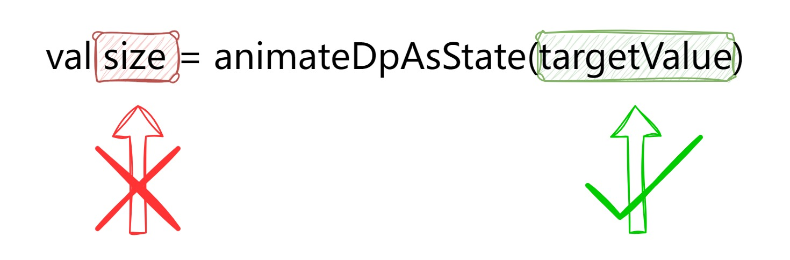
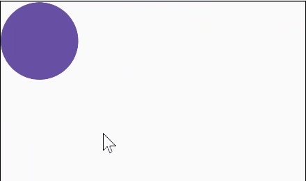
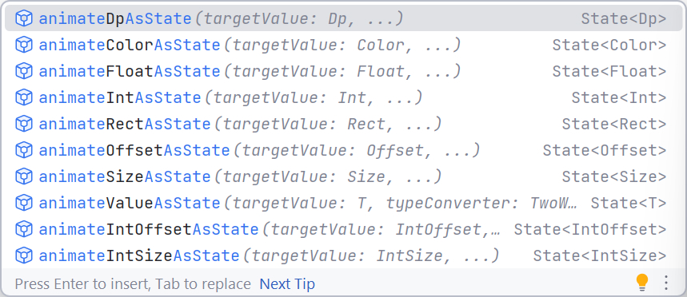
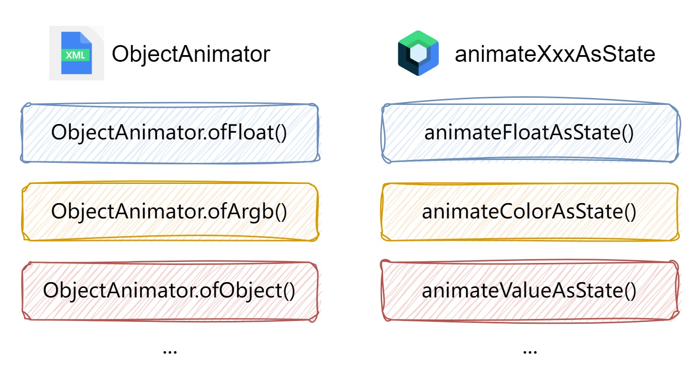
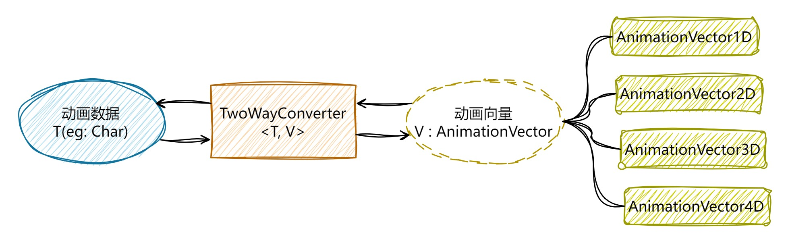
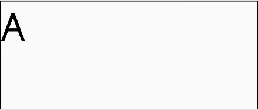
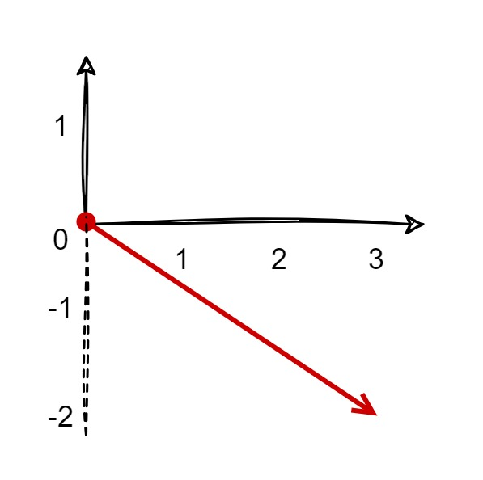
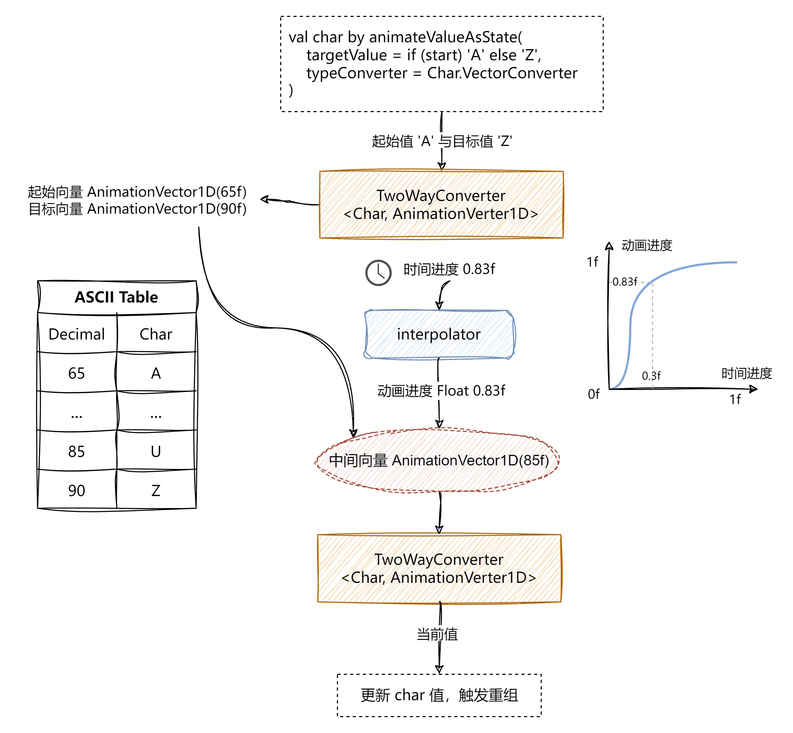

# animateXxxAsState

## animateXxxAsState

在传统 Android View 系统中，要对 View 的通用属性做动画，可以利用 ViewPropertyAnimator：

```kotlin
view.animate()
	.alpha(0.5f)
    .rotation(90f)
	.start()
```

而对于其他属性，可以使用 ObjectAnimator：

```kotlin
ObjectAnimator
	.ofFloat(circleView, "radius", 50f, 100f)
	.start()
```


可以看出传统 View 的属性动画过程，就是在一段时间内持续调用 view 的 setXXX 函数，以此来刷新界面显示动画，这个过程是在持续地操纵 view 对象。而由于 Compose 是声明式 UI 框架，是没有办法获取到界面元素对象的，更新界面的唯一方法是通过新参数调用同一可组合项，这些参数是界面状态的表现形式。

```kotlin
setContent {
    var size by remember { mutableStateOf(100.dp) }
    Box(
        modifier =
            Modifier.size(size)
                .clip(RoundedCornerShape(50))
                .background(color = MaterialTheme.colorScheme.primary)
                .clickable { size = 200.dp }
    )
}
```


点击后界面是被更新了，可是现在要做的是**动画**，这种瞬间完成的界面刷新不是我们想要的，我们要的是在一段时间内 逐渐变化刷新至目标值的界面刷新。

我们要使用 `animateDpAsState()` 而不是 `mutableStateOf()`。用 `animateDpAsState()` 创建的 State 对象，被设置新的 target 值时，内部的 value 会从当前值逐渐变化至 target 值。

```kotlin
setContent {
    // 因为 animateDpAsState() 返回的就是 State 对象，所以不需要用 mutableStateOf() 包裹它
    // 同时因为其内部会自动用 remember 包装，所以也无需手动再包装一层 remember 函数
    // var size by remember { mutableStateOf(100.dp) }
    var size by animateDpAsState(100.dp)
    Box(
        modifier =
            Modifier.size(size)
                .clip(RoundedCornerShape(50))
                .background(color = MaterialTheme.colorScheme.primary)
                .clickable { size = 200.dp }
    )
}
```

但上面的代码还是有问题，IDE 会自动报错提示：

```
Type 'State<Dp>' has no method 'setValue(Nothing?, KProperty<*>, Dp)' and thus it cannot serve as a delegate for var (read-write property)
```

意思是说因为 size 是 var 声明的，所以它是可读可写的，而且用 `by` 将变量的读/写操作委托给了 `animateDpAsState()` 返回的 State 对象，但 State 对象并没有代理 set 操作的能力，只有 MutableState 才有代理 set 的能力。唯一的办法就是用 `val` 来声明 size 变量：

```kotlin
val size by animateDpAsState(100.dp)
```

...... 做动画肯定要改变状态的值，现在状态声明为不可变，那还怎么改？Compose 团队将 `animateDpAsState()` 返回值设计成 State 而不是 MutableState，很明显就是不想开发者去操纵这个 State 对象赋予新的动画 target 值。动画 target 值是通过 `animateDpAsState(targetValue = ...)` 函数参数来设置的：

```kotlin
setContent {
    var isSmall by remember { mutableStateOf(true) }
    val size by animateDpAsState(targetValue = if (isSmall) 100.dp else 200.dp)
    Box(
        modifier =
            Modifier.size(size)
                .clip(RoundedCornerShape(50))
                .background(color = MaterialTheme.colorScheme.primary)
                .clickable { isSmall = !isSmall }
    )
}
```





为了给 `animateDpAsState()` 传递不同的 targetValue（100.dp 是 small 状态下的值，200.dp 是非 small 状态下的值），所以还需要新建一个状态变量 isSmall。这么写的好处是：动画的 targetValue 与状态是挂钩的，触发动画时，不需要关心动画具体 target value 是什么，点击事件产生后只需专注于状态本身的改变。这种设计是一种思路上的改变，在上面的例子里，对于事件产生处 `.clickable { ... }`，它脑子里只有一件事：点击切换大小状态，如果现在大就切换到小，如果现在小就切换到大。大的尺寸和小的尺寸？我不知道啊，不归我管吧。


## animateValueAsState

前面只提到 `animateDpAsState`，其实还有很多孪生函数 animateXxxAsState，用法都是一样的



也就是说，Dp、Color、Int、Float、Rect...等等类型，我们都能使用 `animateXxxAsState` 轻松创建动画，那如果自定义类型呢？如果想让字符 Char 根据 ASCII 值的改变进行动画（从 A 到 Z），在传统 View 里面，可以使用 `ObjectAnimator.ofObject()` + `自定义 TypeEvaluator`。

Compose 里面虽然没有 animateCharAsState 或 animateAsciiAsState，不过我们可以用 `animateValueAsState`：



```kotlin
setContent {
    var onASide by remember { mutableStateOf(true) }
    val char by animateValueAsState(
        targetValue = if (onASide) 'A' else 'Z',
        typeConverter = /* 需要一个类型转换器 */
    )

    Text(
        text = char.toString(),
        modifier = Modifier.clickable { start = !start },
        fontSize = MaterialTheme.typography.displayLarge.fontSize
    )
}
```

与其他几个 `animateXxxAsState` 函数不同，除了参数 targetValue，`animateValueAsState()` 还要求必须填入一个类型转换器（`TwoWayConverter`）

```kotlin
@Composable
fun <T, V : AnimationVector> animateValueAsState(
    targetValue: T,
    typeConverter: TwoWayConverter<T, V>,
    ...
): State<T>

// 用于二者互相转换：动画数据类型 <-> AnimationVector
interface TwoWayConverter<T, V : AnimationVector> {
    /**
     * Defines how a type [T] should be converted to a Vector type (i.e. [AnimationVector1D],
     * [AnimationVector2D], [AnimationVector3D] or [AnimationVector4D], depends on the dimensions of
     * type T).
     */
    val convertToVector: (T) -> V
    /**
     * Defines how to convert a Vector type (i.e. [AnimationVector1D], [AnimationVector2D],
     * [AnimationVector3D] or [AnimationVector4D], depends on the dimensions of type T) back to type
     * [T].
     */
    val convertFromVector: (V) -> T
}
```

`TwoWayConverter` 用于动画数据类型与动画向量类型之间相互转换：

- 动画数据类型指的是我们要做动画的数据类型，比如 Dp、Color、Int、Float、Rect...等等类型；
- 动画向量类型指的是 `AnimationVector`，`AnimationVector` 是 Compose 动画系统中的一个密封基类，共有 4 个子类 `AnimationVector1D`、`AnimationVector2D`、`AnimationVector3D` 和 `AnimationVector4D`，分别对应 1 维、2 维、3 维、4 维的动画向量。



开发者应根据动画数据类型所具有的维度来选择不同的 `AnimationVector`，现在要对字符 Char 做动画，具体是靠对应的 ascii 码来计算的，1 个 Char 对应 1 个 ascii 码，也就是说计算 Char 动画只涉及到 1 个属性，那么数据类型 Char 的动画维度就是 1。

```kotlin
val Char.Companion.VectorConverter: TwoWayConverter<Char, AnimationVector1D>
    get() = object : TwoWayConverter<Char, AnimationVector1D> {
        override val convertFromVector: (AnimationVector1D) -> Char
            get() = { vector -> Char(code = vector.value.toInt()) }
        override val convertToVector: (Char) -> AnimationVector1D
            get() = { char -> AnimationVector1D(char.code.toFloat()) }
    }
// CharVectorConverter 的作用：
// 动画类型 Char <-> 动画向量 AnimationVecto

setContent {
    var onASide by remember { mutableStateOf(true) }
    val char by animateValueAsState(
        targetValue = if (onASide) 'A' else 'Z',
        Char.VectorConverter
    )

    Text(
        text = char.toString(),
        modifier = Modifier.clickable { start = !start },
        fontSize = MaterialTheme.typography.displayLarge.fontSize
    )
}
```



其实 `animateDpAsState`、`animateSizeAsState`、`animateRectAsState`...它们都是使用了 `animateValueAsState` 来实现的，之所以使用的时候不需要我们传入一个 `typeConverter: TwoWayConverter`，是因为 Compose 官方已经为几种常见类型创建了相应的 VectorConverter：

```kotlin
@Composable
fun animateDpAsState(
    targetValue: Dp,
    animationSpec: AnimationSpec<Dp> = dpDefaultSpring,
    label: String = "DpAnimation",
    finishedListener: ((Dp) -> Unit)? = null
): State<Dp> {
    return animateValueAsState(
        targetValue,
        Dp.VectorConverter,  // <---------------------
        animationSpec,
        label = label,
        finishedListener = finishedListener
    )
}

val Dp.Companion.VectorConverter: TwoWayConverter<Dp, AnimationVector1D>
    get() = DpToVector

private val DpToVector: TwoWayConverter<Dp, AnimationVector1D> = TwoWayConverter(
    convertToVector = { AnimationVector1D(it.value) },
    convertFromVector = { Dp(it.value) }
)
```


## AnimationVector

这个动画向量 AnimationVector 老实说挺让人费解的。动画，明白！向量......勉强明白，中学数学知识，有大小，有方向。可是代码里面的 "动画向量" 是什么玩意，完全不理解。

向量 Vector 最初是几何学里面的概念，指具有大小和方向的几何对象，可以形象地表示为带箭头的线段：箭头所指，代表向量的方向；线段长度，代表向量的大小。中学里可以复数来表示的向量，如 3-2i，其实相当于 x 和 y
两个向量维度空间里的向量，可看作是点 (0, 0) 指向 (3, -2)



向量除了用箭头表示外，在数据计算领域常用表示方法，即用 （a, b, c, …) 来表示。其中，a、b、c...每个元素都是一个维度上的数据取值。

```kotlin
data class Car(
    val brand: String,    // 品牌
    val model: String,    // 型号
    val year: Int,        // 出厂年份
    val color: String     // 颜色
)

上面的叫做向量定义，下面的叫做向量实例。

val car = Car(
    brand = "Toyota",
    model = "Camry",
    year = 2022,
    color = "Blue"
)
```

在 kotlin 里，向量的定义其实就可以理解成类的定义，向量上每个不同的属性就是不同的维度。

我们前面用 `animateValueAsState()` 对 Char 进行动画，typeConverter 的类型是 `TwoWayConverter<Char, AnimationVector1D>`，使用 `AnimationVector1D` 是因为只需利用 Char 的 1 个属性来计算动画， 动画的维度是一维的。

如果需要对 `class Position(val x: Int, val y: Int)` 做动画，有两个属性需参与动画计算，就应该使用 `AnimationVector2D`。


